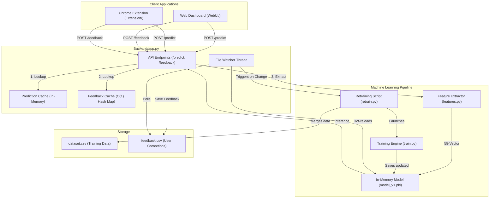

# PhishGuard AI — Real-Time Phishing Website Detection System

[](https://www.python.org/)
[](https://scikit-learn.org/)
[](LICENSE)
[](https://github.com/VarshithReddy2006/PhishingWebsite_Detection/stargazers)
[](https://github.com/VarshithReddy2006/PhishingWebsite_Detection/network/members)
[](https://github.com/VarshithReddy2006/PhishingWebsite_Detection/issues)
[](https://github.com/VarshithReddy2006/PhishingWebsite_Detection/commits/main)

PhishGuard AI is an open-source, local-first cybersecurity utility designed to detect phishing URLs. By extracting **58 engineered features** from the structure of a URL and evaluating them using a local machine learning model, it detects malicious links before they are added to traditional blacklists. The project consists of a **Flask API Backend**, a **Web Dashboard**, and a **Chrome Extension (Manifest V3)** to verify links directly in the browser.

---

## 🎯 Project Highlights

* **Local-First Execution:** Runs entirely on the user's local machine. URL classification does not require external threat-intelligence lookups.
* **Low-Latency Feature Extraction:** Extracts 58 structural and lexical features in under 2ms.
* **Extension & Dashboard Integration:** Offers a Chrome Extension (Manifest V3) for in-browser warning banners and a central Flask web dashboard.
* **Automated Local Feedback Loop:** Watches for user-submitted corrections in a local CSV file, retrains the model in the background, and hot-swaps the model file in-memory.
* **High Validation Performance:** Achieves **90.83% accuracy** using a Gradient Boosting Classifier on the test split.

---

## 📖 Table of Contents
1. [Why This Project](#-why-this-project)
2. [Key Capabilities](#-key-capabilities)
3. [Detection Coverage](#-detection-coverage)
4. [Security & Deployment Configuration](#-security--deployment-configuration)
5. [System Architecture](#-system-architecture)
6. [Feedback & Hot-Reload Retraining Loop](#-feedback--hot-reload-retraining-loop)
7. [Model Benchmark & Performance](#-model-benchmark--performance)
8. [Dataset Information](#-dataset-information)
9. [Tech Stack](#-tech-stack)
10. [Quick Start (Windows)](#-quick-start-windows)
11. [Chrome Extension Setup](#-chrome-extension-setup)
12. [Project Structure](#-project-structure)
13. [API Endpoints](#-api-endpoints)
14. [Feature Engineering Categories](#-feature-engineering-categories)
15. [Adding Custom Features](#-adding-custom-features)
16. [Known Limitations](#-known-limitations)
17. [Roadmap & Future Enhancements](#-roadmap--future-enhancements)
18. [Contributing Guidelines](#-contributing-guidelines)
19. [License](#-license)
20. [Maintainers](#-maintainers)

---

## 💡 Why This Project

Traditional web defense mechanisms rely heavily on **Static Blacklists** (such as PhishTank or Google Safe Browsing). While highly reliable for blocking known threats, these databases suffer from a protection gap during the first few hours of a new phishing campaign. Since the median lifespan of a phishing site is often under 24 hours, attackers actively exploit this detection lag.

Additionally, checking every visited URL against a cloud-based server introduces network latency and raises privacy concerns regarding user web history.

**PhishGuard AI** addresses this by analyzing the **structural attributes of URLs locally**:
* **Pattern-Based Detection:** Evaluates the heuristic and structural patterns common to deceptive links to catch unseen domains before they are indexed on public blacklists.
* **Local Inferences:** No network lookups are made to third-party APIs during evaluation, resulting in a **sub-15ms inference latency**.
* **Local Continuous Retraining:** Enables individual users or enterprise deployments to run automated local retraining scripts that adapt the model to localized feedback patterns.

---

## ⚡ Key Capabilities

* **Structural Feature Extraction:** Evaluates 58 unique parameters (length ratios, keyword occurrences, TLD risk profiles, Punycode indicators) directly from URL syntax.
* **Risk Escalation Safeguard:** Automatically flags predictions predicted as `Legitimate` with low confidence (<60%) as `Suspicious` to prevent false negatives.
* **Seamless Local Training:** Features background file-monitoring that automatically initiates model training when new feedback is logged, merging data and reloading the model without restarting the active web server.
* **Self-Contained Data Processing:** All predictions, training data runs, and local logging are stored locally, avoiding telemetry and cloud transmission.

---

## 🛡️ Detection Coverage

PhishGuard AI analyzes structural and lexical patterns in URL syntax. Below is a breakdown of the specific vectors handled by the system and the structural boundaries of the tool:

### Supported Attack Types
| Vector / Attack Category | Technical Indicator Used |
| :--- | :--- |
| **Typosquatting & Lookalikes** | Punycode validation (`xn--`), character repeat metrics, TLD-in-path alignment checks. |
| **URL Shortening & Redirection** | Validation against active shortener lists (e.g., `bit.ly`, `tinyurl`), double slash counts (`//`). |
| **Credential Harvesting Path Indicators** | Key matches (`login`, `signin`, `secure`, `verify`, `password`) in the URL path or subdomain levels. |
| **Anomalous Network Ports** | Checks for non-standard web traffic ports (other than default HTTP/HTTPS `80` and `443`). |
| **TLD Reputation Analysis** | Scoring based on high-risk domain registers (e.g., `.xyz`, `.buzz`, `.ml`, `.tk`). |
| **Random Hostname / DGA Signals** | Calculations of subdomain and hostname Shannon entropy to identify generated domains. |

### Out of Scope (Limitations of URL-only Inference)
* **DNS Spoofing / Hijacking:** Cannot verify if a legitimate domain's DNS entries have been altered or compromised.
* **Compromised Trusted Domains:** Phishing files hosted inside legitimate domains (e.g., a subpath on `github.com` or `medium.com`) will not be flagged if the root domain has high legitimacy scores.
* **Server-Side Payloads & Scripts:** Does not execute or inspect DOM structures, HTML form elements, or JavaScript code.

---

## 🔧 Security & Deployment Configuration

The following parameters define the security and execution profile of PhishGuard AI:
1. **Input Parameters validation:** Incoming requests to `/predict` and `/feedback` require JSON payload extraction. Missing or null URL parameters are intercepted at the server entry point and rejected with an HTTP 400.
2. **CORS Policy:** Runs a development-friendly wildcard CORS configuration (`CORS(app, resources={r"/*": {"origins": "*"}})`), allowing the local Flask instance to receive prediction payloads from any local port or browser extension.
3. **Atomic Artifact Writes:** During model training cycles, model pickles are generated in temporary staging files first. Upon successful compilation, they are swapped atomically via `os.replace` to prevent runtime access errors.
4. **Local Data Persistence:** Feedback data is saved in a local CSV file (`feedback.csv`) within the project structure. No external telemetry or cloud log exports are integrated.

---

## 📐 System Architecture

The layout below illustrates the communication path between client layers, the API backend, and the local ML training processes:



---

## 🔄 Feedback & Hot-Reload Retraining Loop

PhishGuard AI runs an automated pipeline to process corrections and retrain the model locally:

1. **User Submission:** When a user flags a classification error, the client sends a `POST` request to `/feedback`.
2. **Local Log Update:** The backend appends the URL and corrected status to [feedback.csv](file:///c:/VARSHITHREDDY/projects/PhishingWebsite_Detection/Backend/feedback.csv).
3. **Background Watcher:** A background thread in [app.py](file:///c:/VARSHITHREDDY/projects/PhishingWebsite_Detection/Backend/app.py) monitors the modification time of `feedback.csv`. When changes occur, it queues the execution of [retrain.py](file:///c:/VARSHITHREDDY/projects/PhishingWebsite_Detection/Backend/retrain.py) after a 60-second cooldown to batch submissions.
4. **Dataset Update & Training:** [retrain.py](file:///c:/VARSHITHREDDY/projects/PhishingWebsite_Detection/Backend/retrain.py) parses the user entries, checks for duplicates, appends new samples to [dataset.csv](file:///c:/VARSHITHREDDY/projects/PhishingWebsite_Detection/Backend/dataset.csv), and runs the training suite ([train.py](file:///c:/VARSHITHREDDY/projects/PhishingWebsite_Detection/Backend/train.py)).
5. **Hot-Reloading:** Once the training script outputs the updated model to `model_v1.pkl`, the watcher detects the change and updates the global `model` variable in memory. **The REST API server remains online and ready during the hot-swap.**

---

## 📊 Model Benchmark & Performance

During validation, the training suite evaluates both a **Random Forest Classifier** and a **Gradient Boosting Classifier** using an 80/20 train/test split. The pipeline evaluates performance metrics on the test split, choosing the model with the highest validation accuracy to serialize as `model_v1.pkl`.

Below are the benchmark metrics obtained from the training runner:

| Classifier Model | Validation Accuracy | Validation Precision | Validation Recall | Validation F1-Score |
| :--- | :---: | :---: | :---: | :---: |
| **Random Forest** | 90.04% | 89.85% | 90.15% | 90.00% |
| **Gradient Boosting** | **90.83%** | **90.75%** | **90.91%** | **90.83%** |

*Note: Gradient Boosting was automatically selected for the active deployment due to its superior generalization capabilities and higher accuracy across unseen test URLs.*

---

## 📊 Dataset Information

The model is trained on a structured dataset compiled from verified threat sources (such as PhishTank and OpenPhish) and legitimate web indexes.

* **Total Dataset Size:** **11,438** unique URLs (post-deduplication and validation).
* **Class Balance:**
  * **Legitimate (Class 0):** 5,722 URLs (50.03%)
  * **Phishing (Class 1):** 5,716 URLs (49.97%)
* **Imbalance Mitigation:** The dataset is intentionally balanced to prevent model bias toward a specific class. Stratified splits are configured during training (`stratify=y`) to maintain the ratio across train and test sets.

---

## 🛠️ Tech Stack

* **Backend Framework:** Python 3.10+, Flask 3.0+, Flask-CORS
* **Machine Learning & Analytics:** Scikit-Learn, Pandas, NumPy, Joblib
* **Semantic Analysis (Optional):** PyTorch & HuggingFace Transformers (DistilBERT base model utilized for semantic URL embedding caching when enabled via environment variables)
* **Frontend Dashboard:** Vanilla HTML5, CSS3, ES6 JavaScript
* **Extension Sandbox:** Chrome Extensions Manifest V3 API

---

## 🚀 Quick Start (Windows)

The repository provides a single-command runtime launcher that handles environment checks, dependency installs, model training, and server execution automatically.

### Easiest Startup (Windows Command Prompt or Double-Click)
Simply run the batch launcher from your project root:
```cmd
start_backend.cmd
```

### Alternatively (PowerShell)
If you prefer running via PowerShell, execute:
```powershell
powershell -ExecutionPolicy Bypass -File .\run.ps1
```

> [!TIP]
> The launcher will detect if a python virtual environment `.venv` exists. If missing, it automatically creates it, upgrades `pip`, installs `requirements.txt`, trains the ML model (if `model_v1.pkl` is not found), and starts the Flask server on **http://127.0.0.1:5000**.

---

## 🔌 Chrome Extension Setup

1. Open Google Chrome and navigate to `chrome://extensions/`
2. Enable **Developer mode** using the toggle in the top-right corner.
3. Click **Load unpacked** in the top-left corner.
4. Select the [Extension/](file:///c:/VARSHITHREDDY/projects/PhishingWebsite_Detection/Extension) directory from this project workspace.

The extension is now active and will display prediction flags in its popup interface when you browse.

---

## 📂 Project Structure

```text
PhishingWebsite_Detection/
├── Backend/
│   ├── app.py           # Flask API server & feedback watcher thread
│   ├── features.py      # Real-time 58-feature URL extractor
│   ├── train.py         # Model training, validation & serialization script
│   ├── retrain.py       # Feedback merger and retraining pipeline
│   ├── utils.py         # CSV utilities & auto-venv relaunch helpers
│   ├── dataset.csv      # The core training dataset (~11k balanced URLs)
│   ├── feedback.csv     # User-submitted prediction corrections
│   ├── model_v1.pkl     # Serialized active classifier
│   └── feature_names.pkl# List of active training feature columns
├── WebUI/
│   ├── index.html       # Web Dashboard layout
│   ├── feedback.html    # Dashboard feedback submission form
│   ├── styles.css       # Premium Dashboard UI styling
│   ├── app.js           # Dashboard prediction & UI logic
│   ├── feedback.js      # Feedback API handlers
│   └── shared.js        # Configs & network utils
├── Extension/
│   ├── manifest.json    # Chrome Extension Manifest V3 metadata
│   ├── background.js    # Service worker background listener
│   ├── content.js       # Page DOM integration script
│   ├── popup.html       # Browser toolbar action UI
│   ├── popup.js         # Popup logic & feedback button triggers
│   └── shared.js        # Extension endpoint configurations
├── requirements.txt     # Python pip dependencies
├── setup.ps1            # Explicit environment setup script
├── run.ps1              # Main environment & model check runner
└── start_backend.cmd    # Wrapper command file for one-click launch
```

---

## 📡 API Endpoints

The Flask server listens on port `5000` and exposes the following REST interfaces:

| Method | Endpoint | Payload | Description |
| :--- | :--- | :--- | :--- |
| `POST` | `/predict` | `{"url": "string"}` | Evaluates URL structure and returns a classification with confidence. |
| `POST` | `/feedback` | `{"url": "string", "feedback_type": "string", "comment": "string"}` | Submits a prediction correction to append to the training cache. |
| `POST` | `/features` | `{"url": "string"}` | Returns the key-value dictionary of the 58 extracted features. |
| `GET` | `/health` | None | Basic health-check (returns `{"status": "running"}`). |
| `GET` | `/download/feedback` | None | Stream and download the active `feedback.csv` file. |
| `GET` | `/download/dataset` | None | Stream and download the active `dataset.csv` file. |

---

## 📊 Feature Engineering Categories

The feature extractor translates raw URLs into numerical vectors based on:
1. **URL Structural Analysis:** URL length, hostname length, and counts of specific characters (`.`, `-`, `@`, `?`, `&`, `=`, `/`, `_`, etc.).
2. **Domain Reputation Signals:** Digit-to-letter ratios in host/path, subdomain counts, TLD risk scores (e.g., higher weights for `.xyz`, `.tk`, `.buzz`), and punycode representation (`xn--`).
3. **Suspicious Pattern Matching:** Detects presence of phishing keywords (`login`, `signin`, `verify`), shortening services (e.g., `bit.ly`, `tinyurl`), and double slashes indicating redirections.
4. **Lexical Stat Features:** Minimum, maximum, and average word lengths across the host and path.

---

## 🛠️ Adding Custom Features

To extend the feature set used by the ML model:

1. Open [features.py](file:///c:/VARSHITHREDDY/projects/PhishingWebsite_Detection/Backend/features.py).
2. Append your new feature identifier to the `FEATURE_COLUMNS` array.
3. Update the `extract_features(url)` function to compute your feature and include it in the returned dictionary.
4. Run retraining:
   ```cmd
   python Backend/train.py
   ```
   *The training pipeline will automatically train on the new feature space and serialize the updated assets.*

---

## ⚠️ Known Limitations

Before deploying this system, review the following limitations:
* **Inference Boundaries:** The model only analyzes lexical features. Phishing attacks on trusted platforms (like a compromised page on `medium.com` or a directory on `github.com`) will likely bypass structural detection.
* **Evasion via Path Spoofing:** Attackers can craft highly long, nested subdirectories that mimic legitimate domains. While our model handles this via word-count statistics and path depth features, sophisticated evasion remains possible.
* **Model Drift:** Over time, attackers shift TLD patterns and keyword obfuscation techniques. The model requires periodic retraining with fresh datasets to stay effective.

---

## 🗺️ Roadmap & Future Enhancements

- [ ] **ONNX Runtime Web Integration:** Export the trained Scikit-Learn models to ONNX and run inference directly in the extension's WebAssembly sandbox. This removes the local Flask backend requirement for basic extension usage.
- [ ] **SSL/TLS Certificate Integration:** Fetch and parse target SSL certificates during prediction to evaluate certificate age, issuer reputation, and domain validation levels.
- [ ] **Heuristics for DOM Inspection:** Integrate lightweight content-based rules inside the Chrome extension script to analyze page forms, lookalike logo elements, and input visibility features.
- [ ] **Active DNS/Whois Lookups:** Query domain creation dates during inference to flag recently registered domains (<14 days old).

---

## 🤝 Contributing Guidelines

We welcome contributions from the open-source community, including **GSSoC (GirlScript Summer of Code)** and **Hacktoberfest** participants!

### Development Workflow
1. **Fork the Repository:** Create a personal copy of the repository.
2. **Create a Feature Branch:** Always work on a separate branch:
   ```bash
   git checkout -b feature/YourFeatureName
   ```
3. **Code Quality Standards:**
   * **Python:** Adhere to PEP 8. Use standard typing annotations where applicable.
   * **Frontend:** Maintain Vanilla CSS classes. Avoid introducing heavy framework dependencies unless explicitly discussed in an issue.
4. **Write Clean Commits:** Format commit messages descriptively:
   ```text
   feat: add entropy calculations to feature list
   fix: handle edge case in Punycode domain parsing
   docs: update API endpoints details
   ```
5. **Open a Pull Request:** Provide a clear description of the problem solved and test results.

---

## 📄 License

This project is licensed under the MIT License. See the [LICENSE](LICENSE) file for details.

---

## 👥 Maintainers

* **Varshith Reddy** — varshithreddy6147@gmail.com
* **Boda Karthik Netha** — bodakarthiknetha@gmail.com

---
*Contributions, bug reports, and suggestions are welcome! Feel free to open a Pull Request.*
